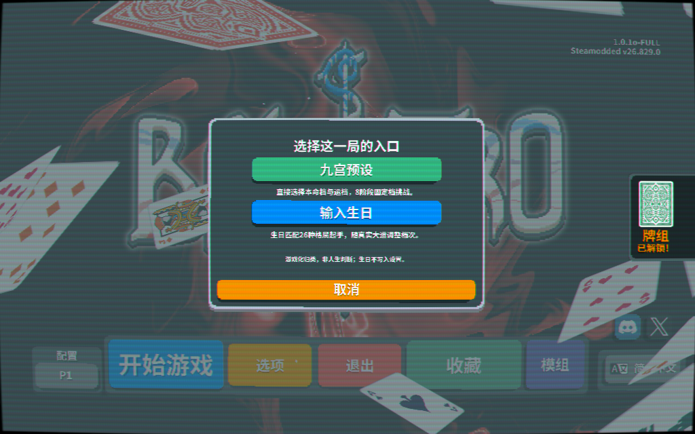

# Nine Paths, One Run · 十年一局

**A Balatro mod about choosing your starting conditions—and playing the hand you are dealt.**

Start immediately with one of nine fixed challenges, or use an offline birthday-to-chart adapter for a themed starter Joker and changing decade stages. Familiar poker hands, shops and deck-building remain; the mod changes your starting companion, score targets and stage rewards.

**Version0.7.0 is a development release.** The birthday classifier has an unresolved officer-resource relationship issue. Assignment coverage is not semantic accuracy and this game does not predict real-world outcomes. The preset route bypasses the classifier entirely. See [known issues](KNOWN-ISSUES.md).

[Download the packaged mod](https://github.com/minimal553/TenYearsOneRun-Balatro/releases/tag/v0.7.0). The repository also contains high-resolution source art; players only need the smaller release ZIP.

## Two ways to start

Select the custom teal/cinnabar **十年一局·命局牌组** deck, then choose:

1. **九宫预设 — Nine-grid presets:** pick natal tier Upper/Middle/Lower and fortune tier Upper/Middle/Lower. The selected pair stays fixed across8antes and endless mode. No birthday is needed. All presets receive the same General Pattern Joker: +4Mult and +20Chips per hand, without an extra trait.
2. **输入生日 — Birthday matching:** enter a Gregorian birth date, Beijing time and the calculation convention. `730`, `0730` and `7:30` are accepted. Preview the assigned chart category, evidence, optional trait and8decade stages. Confirmation always starts at the first stage; previewing a later decade does not skip stages.

Back/cancel does not launch a run or consume a run restart. Continue uses its saved snapshot rather than asking for new data. Birth input is not written to mod settings or uploaded; chart/stage data required for continuation are stored in the local game save.

## Nine targets and rewards

The rank is natal-major: Upper/Upper is1; Upper/Middle2; Upper/Lower3; Middle/Upper4; Middle/Middle5; Middle/Lower6; Lower/Upper7; Lower/Middle8; Lower/Lower9.

| Rank | Target multiplier | Fortune ticket produces |
|---|---:|---|
|1|1.000|1original **Soul**. Use it to create a random Legendary Joker; a free Joker slot is required.|
|2|1.125|1random ordinary **Spectral** card.|
|3|1.250|1random ordinary **Spectral** card.|
|4|1.375|2random **Tarot** cards.|
|5|1.500|2random **Tarot** cards.|
|6|1.625|50%:2**Mult** playing cards (+4Mult each);50%:2**Bonus** playing cards (+30Chips each). One same-type pair, not one of each.|
|7|1.750|50%:1random Tarot;50%:1random Planet.|
|8|1.875|50%:1random Tarot;50%:1random Planet.|
|9|2.000|1**Pluto**, the High Card Planet.|

Multipliers apply to the ordinary target for that ante/stake, not a fixed score. Every new ante grants one fortune ticket. The custom envelope is not Emperor and never opens a Joker booster. Use the envelope first, then use the resulting original consumable when its native conditions allow. Spectral cards keep their original costs/trade-offs; the mod does not make every random Spectral unconditionally beneficial.

The enhanced pair is permanent and enters the current hand during a blind. Full consumable slots queue undelivered promises instead of dropping them. Random reward-type choices are locked when claimed, then saved after the use animation returns to a stable state—even when inventory is full. After that save, repeated updates, continuation and copied claim IDs cannot reroll the branch or duplicate it. This does not claim to prevent ordinary rollback from terminating the game before a save completes.

**Upgrade compatibility:** new0.7runs use the table above. Saved0.6and earlier runs keep their old reward table, existing tickets and already queued effects. This is intentional; start a new run for the new rewards.

## All26starter Jokers

Each starter provides **+4Mult per hand**, plus the effect below. They are exclusive starters rather than ordinary random shop-pool cards. Selling one does not grant a replacement.

| Chinese name | Gameplay name / additional effect |
|---|---|
|正官格|Direct Officer: scoring includes a face card → +6Mult.|
|七杀格|Seven Killings: play at most3cards → +8Mult.|
|正财格|Direct Wealth: +$2at blind-end payout.|
|偏财格|Indirect Wealth: +$3at payout if hands remain.|
|正印格|Direct Resource: +10Chips per non-debuffed face card held, capped at60.|
|偏印格|Indirect Resource: play at most3cards → +40Chips.|
|食神格|Eating God: +1Mult per scoring non-face card.|
|伤官格|Hurting Officer: at least3scoring non-face cards → +8Mult.|
|建禄格|Established Support: +30Chips per hand.|
|月劫格|Monthly Peer: the played hand contains a Pair → +6Mult.|
|阳刃格|Yang Blade: play exactly5cards → +8Mult, even if not all5score.|
|从财格|Follow Wealth: +1Mult per$5held, capped at16extra.|
|从杀格|Follow Killing: no discards remaining → X1.8Mult.|
|从儿格|Follow Output: all scoring cards are non-face → +8Mult.|
|从势格|Follow Momentum: at least3scoring suits → X1.5Mult.|
|曲直格|Wood Formation: contains a Straight → +30Chips and +6Mult.|
|炎上格|Fire Formation: +10Chips per scoring Heart.|
|稼穑格|Earth Formation: at least2unenhanced scoring cards → +40Chips.|
|从革格|Metal Formation: +10Chips per scoring Spade.|
|润下格|Water Formation: +10Chips per scoring rank2–5.|
|化土格|Transform Earth: exactly2scoring suits → +50Chips.|
|化金格|Transform Metal: +15Chips per scoring enhanced card.|
|化水格|Transform Water: at least2scoring suits → +6Mult.|
|化木格|Transform Wood: contains a Straight or Flush → +6Mult.|
|化火格|Transform Fire: contains a Full House → X2Mult.|
|常规命局|General Pattern: +20Chips per hand; no forced special classification.|

Base rank values remain unchanged: J/Q/K=10Chips; A=11Chips.

Up to one of12composite traits can attach to the same birthday starter without using another Joker slot: officer-resource, killing-resource, Eating-God-generates-wealth, Hurting-Officer-generates-wealth, Hurting-Officer-with-resource, Eating-God-controls-killing, wealth-generates-officer, wealth-supports-killing, peers-compete-for-wealth, indirect-resource-controls-output, officer/killing coexistence, and resource-peer support. The actual card text states the effect. The two generates-wealth traits really pay an additional$1at blind-end payout.

## Why these mechanics?

The mod keeps the decision load small: learn your one starter, read the current target, and choose when to spend the stage reward. Fixed presets let you compare challenge levels without supplying personal information. The birthday route adds variation, but its labels are explicitly versioned game rules—not a claim that a chart determines a person's value or future. Conflicting/mixed cases have an honest General Pattern fallback.

The art uses symbolic silhouettes, restrained backgrounds and two opposite vertical JOKER marks.29selected high-resolution project originals, prompt records and five1x/2x runtime atlases are included; no game binaries or proprietary engine dump is redistributed. See [asset provenance](docs/ASSETS.md).

## Install

1. Install Lovely and Steamodded for your own copy of Balatro. Verification used Balatro1.0.1o-FULL, Lovely0.9.0 and Steamodded26.829.0; arbitrary other versions/mod combinations are not guaranteed.
2. Close the game and back up an existing installation. Keep your save files.
3. From the repository, copy **only `mod/TenYearsNineGrid`** into `%APPDATA%/Balatro/Mods`. From the packaged release ZIP, use its top-level `TenYearsNineGrid`folder.
4. Avoid nested duplicates such as `Mods/TenYearsNineGrid/TenYearsNineGrid`. Launch the game and start a new run with the custom deck.

Python/Node are development-only dependencies; the in-game calendar runs offline in Lua. The UI/card text is currently Simplified Chinese; this English guide does not imply complete English UI localization.

## Verification and limitations

[Verification record](VERIFICATION.md) · [Development/reproduction](docs/DEVELOPMENT.md) · [Rule details](docs/PATTERN-RULES.md) · [Known issues](KNOWN-ISSUES.md) · [Changelog](CHANGELOG.md)

Fixed UTC+8, Gregorian1901–2099, no birthplace/true-solar-time/historical-DST correction; the UI rejects future birthdays. Tests cover defined behavior and representative dates, not every traditional school's interpretation or all possible mod interactions. No blanket license for the user's original work is added by this synchronization; third-party notices are preserved separately.
