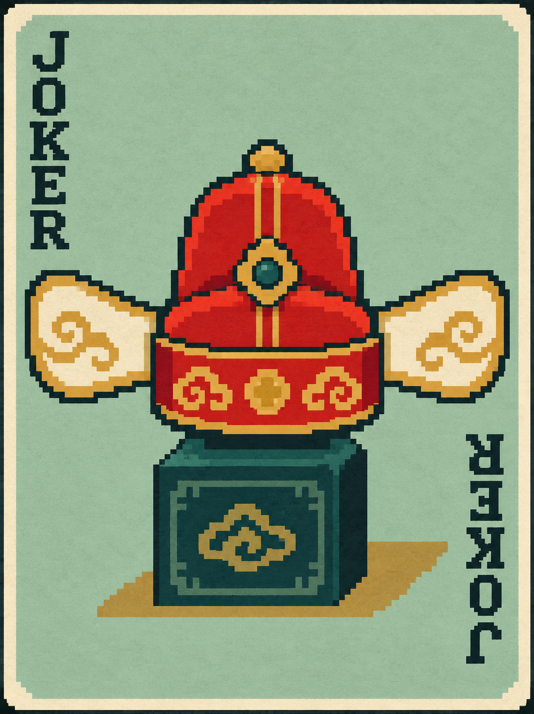
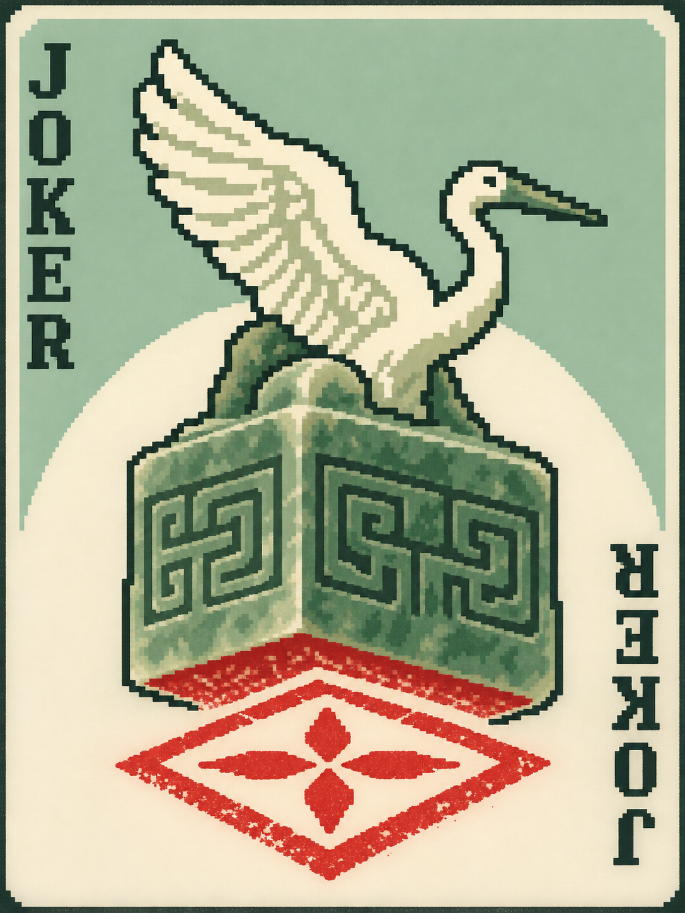
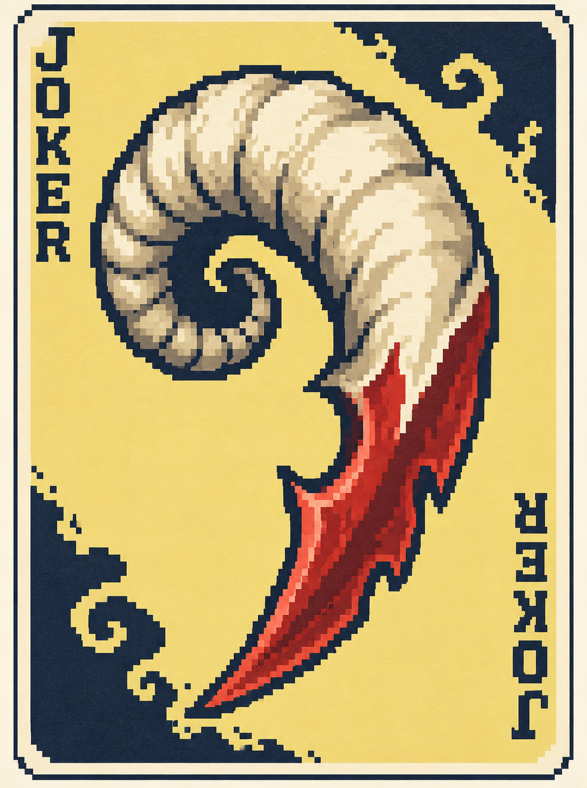
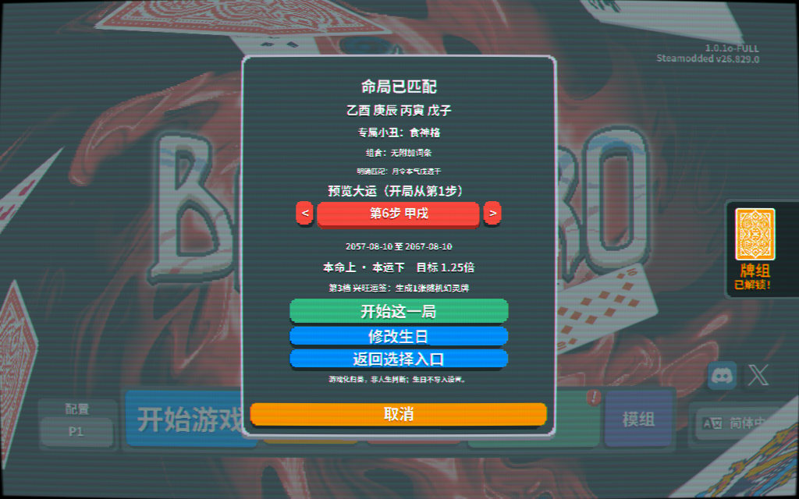
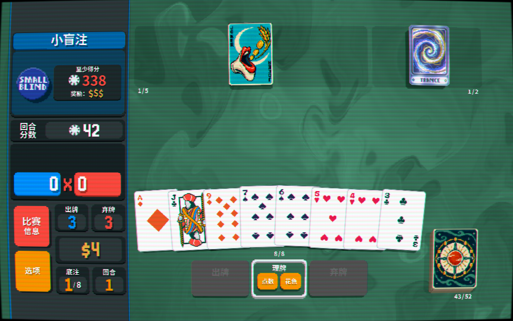
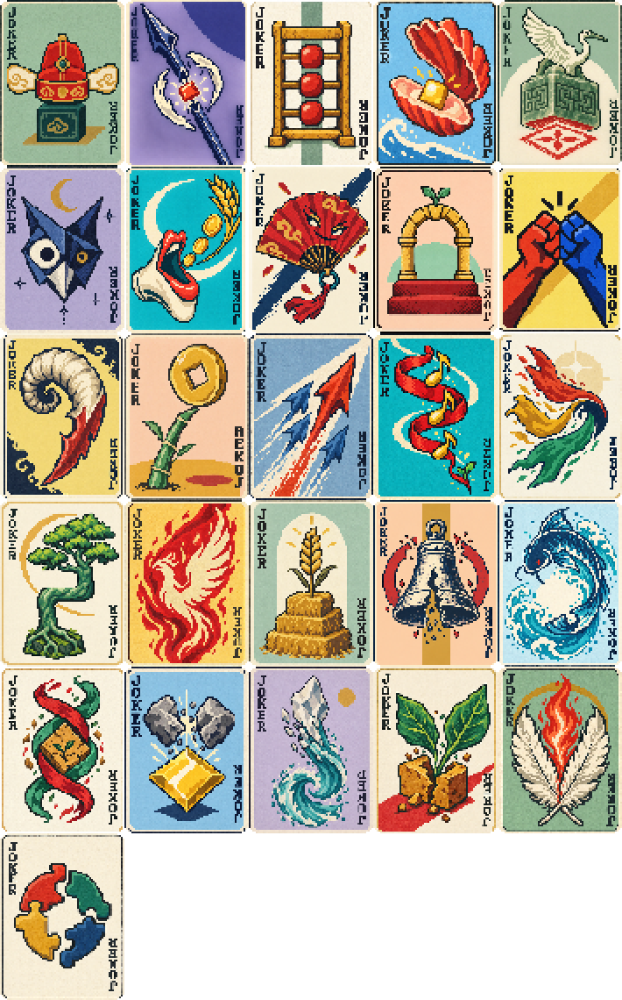
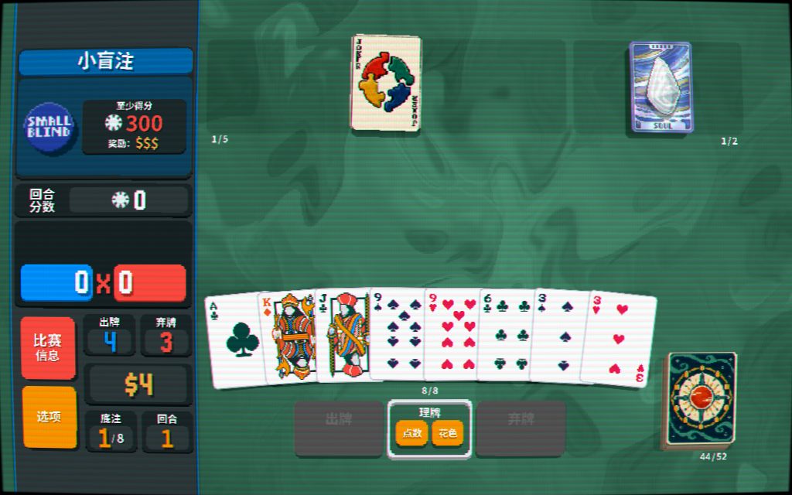

# Ten Years, One Run: Fate at the Card Table | Bazi × Balatro

### Bazi-inspired fate, played one decade at a time

**You cannot choose your birthday. You can choose your next play.**

Turn your birth date and time into a Four Pillars chart, a starting Joker and a sequence of ten-year fortune cycles. As each new ante arrives, the score target and stage reward can change. Make the most of a favorable stretch—or adapt your build when the conditions turn against you.

<table>
<tr>
<td align="center"> <b>Direct Officer</b> Build around scoring face cards</td>
<td align="center"> <b>Direct Resource</b> Keep face cards in hand</td>
<td align="center"> <b>Eating God</b> Give non-face cards a voice</td>
<td align="center"> <b>Yang Blade</b> Commit to a full five-card play</td>
</tr>
</table>

**26 chart-pattern Jokers · 12 optional combinations · 8 decade stages · 9 fortune tiers**

[Download the mod](https://github.com/minimal553/TenYearsOneRun-Balatro/releases/tag/v0.7.0) · [Full art gallery](docs/GALLERY.md) · [中文介绍](README.md)

> **Development build:** the chart classifier is experimental and has a known officer-resource recognition issue. This is a game about fate, not an accurate reading of anyone's real future. [Known issues](KNOWN-ISSUES.md). Screenshots use synthetic test charts, never a player's personal birth information.

## Your chart sets the opening. Your choices shape the run.

| Bazi idea | Balatro expression | The player's decision |
|---|---|---|
| Natal chart pattern | One corresponding starting Joker, with at most one attached combination effect | Build around it, or pivot in the shop? |
| Ten-year fortune cycle | Each ante advances to the next decade in the generated table | Push your advantage, or prepare for a tougher stage? |
| Changing fortune | A 1–2× base target and one of nine stage rewards | When should you spend your resources? |

*This synthetic example receives the Eating God starter and previews its sixth decade. Previewing a later stage does not skip the beginning of the run.*

## Familiar poker. A different arc through the run.

The original hands, shops and Joker-building remain. Your birthday participates in the opening Joker and decade table, while the game's scoring targets and fortune tickets give that table a playable form. Eight antes become eight chapters in this Bazi-inspired run.

A Direct Officer starter favors scoring face cards. Eating God rewards scoring non-face cards. Yang Blade asks you to play five cards even when fewer score. These are different openings for a build—not just different labels.

## See the patterns before you play

Official hats, seals, grain, blades, trees, fire and water turn traditional terminology into symbolic card art. These are the **26 actual in-game card faces**, openly displayed rather than hidden behind a collapsed section.

[Open the named, high-resolution gallery →](docs/GALLERY.md)

## Start with your own birthday

Select the custom teal/cinnabar **十年一局·命局牌组** deck, then choose **输入生日**. Enter a Gregorian date, Beijing time and the calculation convention. `730`, `0730` and `7:30` are accepted. Preview your starting Joker, optional trait and decade stages, then confirm.

Want a quick test without birth information? **九宫预设** offers nine fixed natal/fortune-tier combinations. It uses a shared General Pattern starter and bypasses the classifier. It is the shortcut to trying the mechanics; birthday mode is the route that connects the chart and changing decades.

Back/cancel does not launch a run. Continue restores the existing snapshot. Birth input is not uploaded or written into mod settings; chart/stage data needed to continue are stored in the local save.

## Nine targets and rewards

The rank is natal-major: Upper/Upper is 1; Upper/Middle 2; Upper/Lower 3; Middle/Upper 4; Middle/Middle 5; Middle/Lower 6; Lower/Upper 7; Lower/Middle 8; Lower/Lower 9.

| Rank | Target multiplier | Fortune ticket produces |
|---|---:|---|
|1|1.000|1 original **Soul**. Use it to create a random Legendary Joker; a free Joker slot is required.|
|2|1.125|1 random ordinary **Spectral** card.|
|3|1.250|1 random ordinary **Spectral** card.|
|4|1.375|2 random **Tarot** cards.|
|5|1.500|2 random **Tarot** cards.|
|6|1.625|50%:2**Mult** playing cards (+4 Mult each);50%:2**Bonus** playing cards (+30 Chips each). One same-type pair, not one of each.|
|7|1.750|50%:1 random Tarot;50%:1 random Planet.|
|8|1.875|50%:1 random Tarot;50%:1 random Planet.|
|9|2.000|1**Pluto**, the High Card Planet.|

Multipliers apply to the ordinary target for that ante/stake, not a fixed score. Every new ante grants one fortune ticket. The custom envelope is not Emperor and never opens a Joker booster. Use the envelope first, then use the resulting original consumable when its native conditions allow. Spectral cards keep their original costs/trade-offs; the mod does not make every random Spectral unconditionally beneficial.

The enhanced pair is permanent and enters the current hand during a blind. Full consumable slots queue undelivered promises instead of dropping them. Random reward-type choices are locked when claimed, then saved after the use animation returns to a stable state—even when inventory is full. After that save, repeated updates, continuation and copied claim IDs cannot reroll the branch or duplicate it. This does not claim to prevent ordinary rollback from terminating the game before a save completes.

**Upgrade compatibility:** new 0.7 runs use the table above. Saved 0.6 and earlier runs keep their old reward table, existing tickets and already queued effects. This is intentional; start a new run for the new rewards.

## All 26 starter Jokers

Each starter provides **+4 Mult per hand**, plus the effect below. They are exclusive starters rather than ordinary random shop-pool cards. Selling one does not grant a replacement.

| Chinese name | Gameplay name / additional effect |
|---|---|
|正官格|Direct Officer: scoring includes a face card → +6 Mult.|
|七杀格|Seven Killings: play at most 3 cards → +8 Mult.|
|正财格|Direct Wealth: +$2 at blind-end payout.|
|偏财格|Indirect Wealth: +$3 at payout if hands remain.|
|正印格|Direct Resource: +10 Chips per non-debuffed face card held, capped at 60.|
|偏印格|Indirect Resource: play at most 3 cards → +40 Chips.|
|食神格|Eating God: +1 Mult per scoring non-face card.|
|伤官格|Hurting Officer: at least 3 scoring non-face cards → +8 Mult.|
|建禄格|Established Support: +30 Chips per hand.|
|月劫格|Monthly Peer: the played hand contains a Pair → +6 Mult.|
|阳刃格|Yang Blade: play exactly 5 cards → +8 Mult, even if not all 5 score.|
|从财格|Follow Wealth: +1 Mult per$5 held, capped at 16 extra.|
|从杀格|Follow Killing: no discards remaining → X 1.8 Mult.|
|从儿格|Follow Output: all scoring cards are non-face → +8 Mult.|
|从势格|Follow Momentum: at least 3 scoring suits → X 1.5 Mult.|
|曲直格|Wood Formation: contains a Straight → +30 Chips and +6 Mult.|
|炎上格|Fire Formation: +10 Chips per scoring Heart.|
|稼穑格|Earth Formation: at least 2 unenhanced scoring cards → +40 Chips.|
|从革格|Metal Formation: +10 Chips per scoring Spade.|
|润下格|Water Formation: +10 Chips per scoring rank 2–5.|
|化土格|Transform Earth: exactly 2 scoring suits → +50 Chips.|
|化金格|Transform Metal: +15 Chips per scoring enhanced card.|
|化水格|Transform Water: at least 2 scoring suits → +6 Mult.|
|化木格|Transform Wood: contains a Straight or Flush → +6 Mult.|
|化火格|Transform Fire: contains a Full House → X 2 Mult.|
|常规命局|General Pattern: +20 Chips per hand; no forced special classification.|

Base rank values remain unchanged: J/Q/K=10 Chips; A=11 Chips.

Up to one of 12 composite traits can attach to the same birthday starter without using another Joker slot: officer-resource, killing-resource, Eating-God-generates-wealth, Hurting-Officer-generates-wealth, Hurting-Officer-with-resource, Eating-God-controls-killing, wealth-generates-officer, wealth-supports-killing, peers-compete-for-wealth, indirect-resource-controls-output, officer/killing coexistence, and resource-peer support. The actual card text states the effect. The two generates-wealth traits really pay an additional$1 at blind-end payout.

## Why these mechanics?

The mod keeps the decision load small: learn your one starter, read the current target, and choose when to spend the stage reward. Fixed presets let you compare challenge levels without supplying personal information. The birthday route adds variation, but its labels are explicitly versioned game rules—not a claim that a chart determines a person's value or future. Conflicting/mixed cases have an honest General Pattern fallback.

The art uses symbolic silhouettes, restrained backgrounds and two opposite vertical JOKER marks.29 selected high-resolution project originals, prompt records and five 1×/2× runtime atlases are included; no game binaries or proprietary engine dump is redistributed. See [asset provenance](docs/ASSETS.md).

## Install

1. Install Lovely and Steamodded for your own copy of Balatro. Verification used Balatro 1.0.1o-FULL, Lovely 0.9.0 and Steamodded 26.829.0; arbitrary other versions/mod combinations are not guaranteed.
2. Close the game and back up an existing installation. Keep your save files.
3. From the repository, copy **only `mod/TenYearsNineGrid`** into `%APPDATA%/Balatro/Mods`. From the packaged release ZIP, use its top-level `TenYearsNineGrid`folder.
4. Avoid nested duplicates such as `Mods/TenYearsNineGrid/TenYearsNineGrid`. Launch the game and start a new run with the custom deck.

Python/Node are development-only dependencies; the in-game calendar runs offline in Lua. The UI/card text is currently Simplified Chinese; this English guide does not imply complete English UI localization.

## Verification and limitations

[Verification record](VERIFICATION.md) · [Development/reproduction](docs/DEVELOPMENT.md) · [Rule details](docs/PATTERN-RULES.md) · [Known issues](KNOWN-ISSUES.md) · [Changelog](CHANGELOG.md)

Fixed UTC+8, Gregorian 1901–2099, no birthplace/true-solar-time/historical-DST correction; the UI rejects future birthdays. Tests cover defined behavior and representative dates, not every traditional school's interpretation or all possible mod interactions. No blanket license for the user's original work is added by this synchronization; third-party notices are preserved separately.
