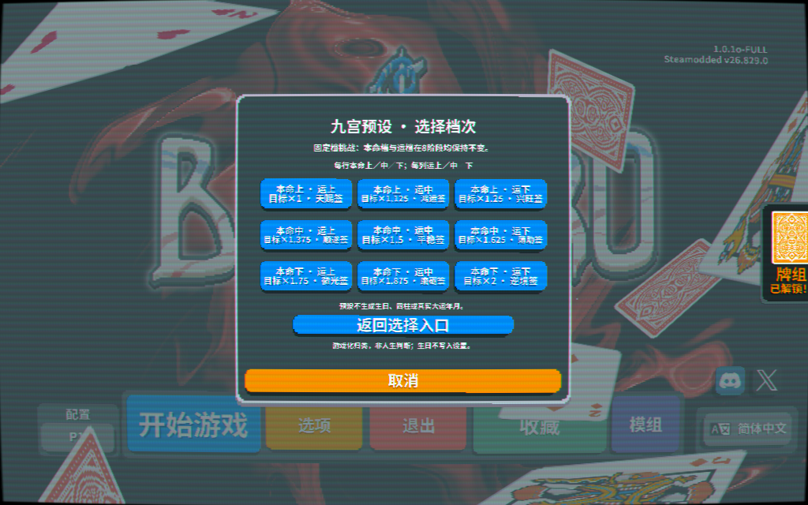

# 十年一局 · Nine Paths, One Run

**Balatro MOD · 九宫预设与生日命局双入口 · 0.6.0 开发版**

选一条路，打一局自己的牌。可以直接挑选九宫挑战，也可以输入生日，让游戏依据四柱分配起手小丑与大运难度。保留Balatro熟悉的出牌与构筑，把变化集中在过关门槛和每步运签。

Choose a fixed nine-grid challenge, or enter a birth date to generate a chart-themed starter Joker and changing decade stages. Keep Balatro's familiar poker loop; vary the scoring target and stage rewards. This is a gameplay adaptation, not a real-life prediction.

> **已知限制：生日匹配存在官印相生漏识别，尚未修复。** 当前版本先完成双入口；预设模式不依赖分类器。[查看已知问题与边界](KNOWN-ISSUES.md)。大规模“有结果”测试不是“格局正确率”证明。

查看26张格局小丑 / View all26pattern cards

输入生日，每个有效命盘获得一张对应的格局小丑。新版本包含 **25类主格/特殊格规则＋常规命局，共26张起手小丑**，以及最多一个组合效果；旧五张卡不再承担所有人的匹配。

## 开始玩

新开一局，选择青绿朱砂命盘牌背的「十年一局·命局牌组」，再选择入口：

- **九宫预设**：本命上／中／下 × 大运上／中／下，共9种固定档挑战。不需要生日，也不虚构四柱；统一给常规命局小丑（每手+4倍率、+20筹码），不附加组合。8个底注始终保留所选两档，每底注发放一次对应运签，无尽模式也保持该档。
- **输入生日**：填写公历生日、北京时间与排运参数。时间可填730、0730、7:30。显示主格、组合、判定依据和各步大运；预览可以切换，确认后总从第一步大运开始。本路线沿用26类匹配及动态大运，但存在上面的已知算法限制。

两条路线都先预览、再确认开局；返回或取消不会消耗当前局。继续已有存档不要求重新选择。

| 本命／大运 | 上 | 中 | 下 |
|---|---|---|---|
| 上 | ×1；2塔罗 | ×1.125；塔罗+星球 | ×1.25；2星球 |
| 中 | ×1.375；1塔罗 | ×1.5；1星球 | ×1.625；$3 |
| 下 | ×1.75；$1 | ×1.875；普通标准牌 | ×2；石头牌 |

“星球”均为路线推荐星球；预设统一推荐冥王星。1至2倍是相对原版同底注、同赌注基准的乘数，不是固定通关分数。

**English quick start:** Select the custom teal/cinnabar deck. Choose **九宫预设** for a birthday-free fixed challenge, or **输入生日** for birthday matching. Every preset starts with the same General Pattern Joker, keeping all8antes at the selected natal/fortune tiers. Birthday runs retain their changing decade table. Back/cancel does not launch a run; Continue restores the existing snapshot.

开局只给**一张**对应主格的小丑；组合效果附在这张牌上，不多占小丑槽。每底注一大运、八底注通关、1～2倍目标和九档运签沿用原玩法。超出第八步的无尽模式保留最后一步档次。

## 26张对应起手牌

每张都先有每手+4倍率，下面列出各自额外效果。它们不是普通商店随机卡池，卖掉不会白送第二次。

| 格局牌 | 额外效果 |
|---|---|
| 正官格 | 计分有人头牌时，再+6倍率 |
| 七杀格 | 打出不超过3张，再+8倍率 |
| 正财格 | 每个盲注结束+$2 |
| 偏财格 | 盲注结束还剩出牌次数时，+$3 |
| 正印格 | 每张留手且未失效的人头牌+10筹码，最多60 |
| 偏印格 | 打出不超过3张，+40筹码 |
| 食神格 | 每张计分非人头牌+1倍率 |
| 伤官格 | 至少3张非人头牌计分，再+8倍率 |
| 建禄格 | 每手+30筹码 |
| 月劫格 | 含对子，再+6倍率 |
| 阳刃格 | 打出完整5张，再+8倍率，不要求5张全计分 |
| 从财格 | 每持有$5再+1倍率，额外最多16 |
| 从杀格 | 本轮弃牌次数用完后，X1.8倍率 |
| 从儿格 | 计分牌全部非人头，再+8倍率 |
| 从势格 | 计分含至少3种花色，X1.5倍率 |
| 曲直格 | 含顺子，+30筹码并再+6倍率 |
| 炎上格 | 每张计分红桃+10筹码 |
| 稼穑格 | 至少2张未增强牌计分，+40筹码 |
| 从革格 | 每张计分黑桃+10筹码 |
| 润下格 | 每张计分2至5，+10筹码 |
| 化土格 | 计分恰好含2种花色，+50筹码 |
| 化金格 | 每张计分增强牌+15筹码 |
| 化水格 | 计分含至少2种花色，再+6倍率 |
| 化木格 | 含顺子或同花，再+6倍率 |
| 化火格 | 含葫芦，X2倍率 |
| 常规命局 | 每手+20筹码，保留混合结构，不强判特殊格 |

J/Q/K仍为10筹码，A仍为11。

## 12种单组合效果

可以识别官印相生、杀印相生、食神生财、伤官生财、伤官配印、食神制杀、财生官、财滋七杀、比劫夺财、枭印夺食、官杀并见、印比相扶。只有符合相应月令、透干、根气和排除条件才附加；没有就是“无附加词条”。

同一张牌最多一个组合，卡牌说明显示名称与实际效果。其中“食神生财”“伤官生财”会在盲注结束真正再给$1。特殊从/化/专旺类不再叠普通十神组合，避免相互冲突。

## 覆盖，不等于强判

- 已区分十神正偏、全部地支藏干、月令、透干、根气及六冲；日干自己不算一份独立比肩。
- 常规月令归类保证有效命盘有对应牌；多项候选不能唯一取格时，用常规命局说明原因。
- 从格、专旺和化气采用联合条件，不是“某五行多就算特殊格”。满足本游戏的特殊条件也标为“倾向”，不冒称流派间没有争议。
- 类型与难度分别计算，正官不自动算好，七杀不自动算差。上/中/下是游戏结构档，不是人生等级。
- 全部条件、数值阈值、流派选择和测试范围见 [规则说明](docs/PATTERN-RULES.md)。

114,624个实际日期时辰抽样均得到唯一对应类型；26类各有2026年以前的真实历法见证。固定抽样未遇到的过去从革，通过额外定向查找找到1968/1970/1980/2018见证，未为了覆盖率放宽判定。这个统计不等于预测现实命运正确率，也不是把全世界所有时间地点都穷举过。

另已遍历1901—2099年的每个公历日期：各时辰代表点加晚子时23:00共944,892个输入，以及所有交节前/中/后分钟边界7,164个输入，合计952,056个输入均得到目录中的唯一主类。匹配只使用四柱，这些检查覆盖了本实现日期/时辰变化的代表状态；不是逐秒计算所有出生地，也不是现实命运准确率。

## 大运与九档运签

本命上/中/下 × 当步大运上/中/下，依次对应9档。倍率为1、1.125、1.25、1.375、1.5、1.625、1.75、1.875、2；最终门槛按HUD显示规则取整，避免显示506却要求506.25。

九档道具分别是：2塔罗；1塔罗+1推荐星球；2推荐星球；1塔罗；1推荐星球；$3；$1；1普通标准牌；1石头牌。红信封运签不是皇帝塔罗，不打开小丑包。每底注只发一次；消耗品栏满则排队补齐，不超槽或少发。生成标准/石头牌会加入永久牌组，战斗中直接进入手牌并触发加牌效果，临时9/8属正常生成牌语义。

从格的大运计算会把重新扶起日元的印比作为不利于当前从势；化格也区分化神与被扶回的原气。这些仍是公开的游戏规则，不是完整命理用神断语。

## 存档和美术

0.3、0.4、0.5存档保留原小丑、档次与奖励，不按新算法重判或重新发牌。0.6双入口仅在新局启用。已有自制牌背、运签与旧五张图保留；此前21幅ImageGen作品及5幅题材相符的既有图组成26个不同格局图格，提供1x/2x原生资源。选用原图、提示词和选择记录在assets下，本版未重画卡面。

固定公历北京时间UTC+8，不作历史夏令时、出生地或真太阳时校正。历法范围1901—2099，界面拒绝未来生日。原始输入不写模组设置；四柱、匹配依据、组合、大运与奖励进度保存在本地游戏存档以便继续，不联网上传。

## 安装与验证

关闭游戏后，将本仓库`mod/TenYearsNineGrid`文件夹（发行ZIP内直接为`TenYearsNineGrid`）复制到 `%APPDATA%/Balatro/Mods`，避免两层同名文件夹。需要Lovely与Steamodded；本项目不附带游戏或加载器。先备份旧版；不要删除个人存档。不要把整个仓库复制进Mods。

**Installation:** Install Lovely and Steamodded for your own copy of Balatro. With the game closed, copy **only** `mod/TenYearsNineGrid` into `%APPDATA%/Balatro/Mods`. Keep your saves and back up an existing version. This repository does not redistribute the base game or other mods.

验收包括规则正反例、覆盖、26卡对应与图集、组合效果、真实引擎输入/发牌/出牌/存盘重启。以[验收记录](VERIFICATION.md)列出的准确构建和范围为准，不把有限测试说成所有第三方组合零缺陷。[开发与复验](docs/DEVELOPMENT.md) · [资源来源](docs/ASSETS.md) · [变更记录](CHANGELOG.md)。
